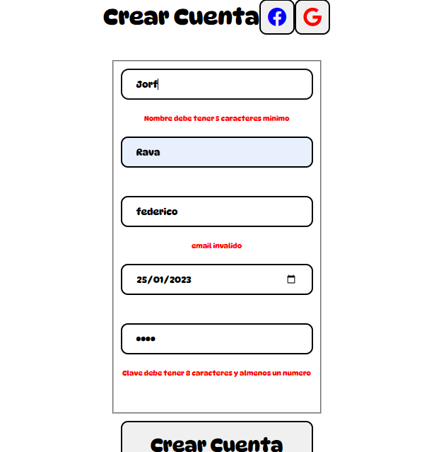

# Sprint V trabajo I

## Formulario

### Elementos importantes
-La vista se encuentra en *Sprint_v_trabajo_I/views/crear_cuenta.ejs* . Dentro de esta vista existe un tag de script (Linea 40) con un link a un archivo externo  
-El script se encuentra en *Sprint_v_trabajo_I/public/scripts_js/script.js*  
-En la linea 22 del script.js se genera una funcion para verificar mediante regex los caracteres introducidos en el campo de correo. Si no se ha introducido los caracteres /@/ y /.com/ se dara como el email invalido y con un evento de *keydown* (Linea 65) se notificara de esto en el formulario 
-En la linea 37 se hace una verificacion por expresion regular al nombre de usuario (Se ha colocado un minimo de 4 letras para hacer desaparecer la notificacion del formulario al colocar la quinta palabra). Esto esta asociado a un evento de *keydown* que se encuentra en la linea 66 
-En la linea 51 se verifica la clave utilizando regex /d/ para que sea obligatorio colocar un digito numerico. El evento asociado al *keydown* se encuentra en la linea 67. Con un if se verifica que la clave tenga la dimension correcta (Esto tambien se podria hacer con regex) 
-En la linea 69 tenemos una funcion para deshabilitar el boton de creacion de cuenta, tiene 4 elementos boleanos (lineas 78-81 , cada uno asociado a: longitu clave de usuario debe tener digito numerico, la clave debe tener longitud mayor a 5 , email debe ser valido y email debe tener longitud mayor igual a 8). Solamente cuando los 4 boleanos son true, se habilita el boton para enviar el formulario. En la linea 99 se tiene el evento asociado
