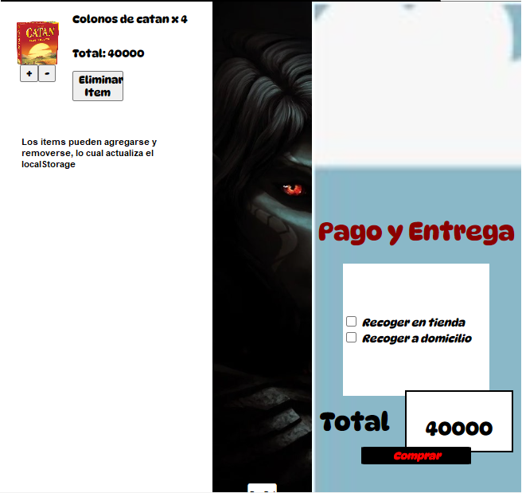
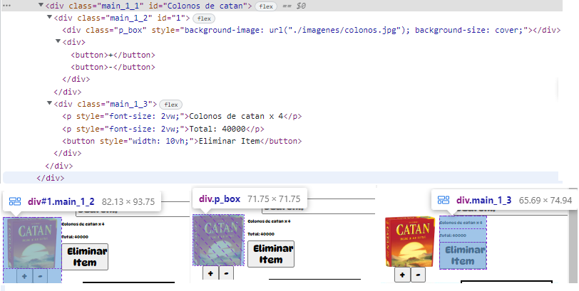

# Sprin V Trabajo II

## Visualizacion
-Para poder visualizar el proyecto hay que descargar el repositorio Bustillos_Rava_Migotona_Ryujin , descargar las ramas y cambiar a la rama sprint_v_trabajo_II
-Abrir una terminal, ingresar a la carpeta *Sprint_v_trabajo_II* ejecutar *nodemon app* (Hay que instalar Express)

## Funcionalidad
-Primero hay que ir al Desktop principal (raiz '/' del proyecto en el *http://localhost:3000/*) En la vista de desktop solamente (me falta ver como hago en mobile), se cargan desde el backend una lista de productos que contienen objetos con la id, nombre, descripcion, precio , url de imagen.

-Al hacer click en el producto estamos haciendo un submit del formulario (metodo get). La informacion se envia por la URL que aparecera en la direccion *'/detail_product'*.

### Elementos relevantes desktop

-La vista de esta pagina se encuentra en: Sprint_v_trabajo_II/views/desktop_principal.ejs 
-Linea 23: Carga de objetos utilizando backend y ejs 
-Linea 26: Principio del Formulario 
-Lineas 35 a 39: Inputs de formulario 

-Al hacer click en algun producto en particular se va a la pagina *'/detail_product'* cuya funcionalidad es hacer un display completo del producto. En concreto lo que esta  sucediendo es que al hacer click en algun producto en '/' estamos llenando un formulario (cuyos campos estan ocultos), los inputs son los elementos del objeto de ese producto. La informacion enviada se muestra en la URL del sitio.

### Elementos relevantes detail_product
-La vista de la pagina se encuentra en: Sprint_v_trabajo_II/views/producto.ejs 
-Esta vista utiliza dos scripts, uno dentro de la misma vista y otra en un archivo externo
-El script del archivo externo (Sprint_v_trabajo_II/public/scrpits_js/detail_product.js) simplemente controla el incremento y decremento del boton para agregar items. Se encuentra incorporado en la linea 72 de producto.ejs 
-El script interno empieza en la linea 73 de rpoducto.ejs . Su funcion es gestionar el boton para agregar elementos, si la cantidad de elmentos es mayor a 0 se agrega al objeto del producto una propiedad denominada *cantidad* cuyo valor es el correspondiente a la cantidad en el display del boton para agregar o quitar elementos. Ademas se genera una alerta que indica si hay o no hay elementos. Finalmente se crea un LocalStorage con los detalles del producto. 

En esta vista se renderizan todos los objetos que se hallen en los diferentes LocalStorage que se hayan creado mediante el proceso anteriormente mencionado 
A los productos que aparecen en esta pagina se los puede editar para actualizar la cantidad que se quiere o bien removerlos del carrito (Lo cual borra el LocalStorage asociado)

### Elementos relevantes de cart
-La vista de la pagina se encuentra en Sprint_v_trabajo_II/views/cart.ejs 
-Esta vista utiliza un unico script que cumple varias funcionalidades (Sprint_v_trabajo_II/public/scrpits_js/addCart.js)

---
Linea 1: DOM de evento para la carga de pantalla 
Linea 3: Funcion que genera un arreglo con los objetos presentes en localStorage. Se puso como numero 10 (Como base de datos se uso un archivo .json ) sin embargo la idea es conectarlo con la base de datos, y de alli obtener la id del ultimo elemento, dicho ciclo for de la funcion deberia ir como maximo hasta esa funcion. 
Linea 13: Obtencion del elemento de la vista relacionado al display del precio total 
Linea 16: Funcion que calcula el precio total de todos los productos en el carrito 
Linea 24: Display del precio total en el elemento de precio total (Inicial) 
Linea 28: Ciclo que genera una estructura HTML para el display de los distintos productos. Tambien contiene funciones creadas para cada producto que editan la cantidad o bien eliminan el producto 

---

